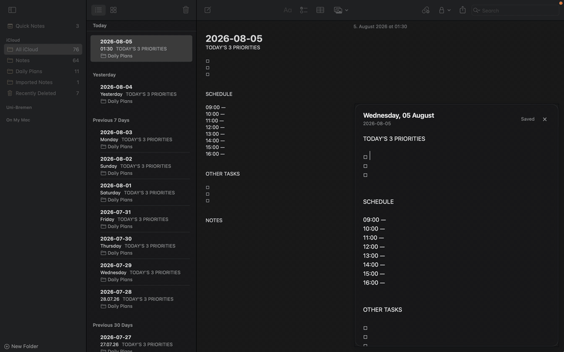

# 📝 Daily Plan for Hammerspoon + Apple Notes

> An instant, zero-friction daily planner & scratchpad popup for macOS powered by [Hammerspoon](https://www.hammerspoon.org/) and backed by native **Apple Notes**.

---

## 📽️ Demo Showcase



<details>
<summary>🎥 Click to view high-res MP4 video</summary>

<video src="demo.mp4" controls autoplay loop muted width="100%"></video>

</details>

---

## 🎯 The Problem It Solves

Daily planning and quick task tracking often suffer from **friction**:
- Heavy productivity apps take time to open, focus, and find today's list.
- Browser tabs and separate windows get buried under workspace clutter.
- Standalone scratchpad apps fragment your notes away from your primary ecosystem.

**Daily Plan** solves this by living quietly in your macOS system background:
1. **Instant Access**: Move your cursor to the **bottom-right corner** of your screen (or press `Cmd + Shift + P`) to reveal your daily plan in milliseconds.
2. **Native Apple Sync**: Automatically creates and syncs today's note (`YYYY-MM-DD`) directly inside your **Apple Notes** (`iCloud -> Daily Plans`). Your plan is immediately available on your iPhone, iPad, and Mac without proprietary sync servers.
3. **Zero Friction**: Auto-saves as you type and auto-hides when you click outside or press `Esc`.

---

## ✨ Key Features

- ⚡ **Lightning Fast**: Preloads today's note in a lightweight background webview for zero popup delay.
- 📐 **Hot Corner & Global Hotkey**: Trigger by hovering over the bottom-right corner or pressing `Cmd + Shift + P`.
- 💾 **Real-time Auto-Save**: Saves directly to Apple Notes on typing or closing.
- 🎨 **Adaptive Dark & Light Mode**: Automatically matches your macOS system appearance.
- 📋 **Built-in Daily Template**: Organizes your day into 3 Priorities, Hourly Schedule, Tasks, and Notes.
- 📁 **Auto Folder Management**: Automatically creates the `Daily Plans` folder in Apple Notes if it doesn't exist.

---

## 🔒 Required Permissions

To function correctly on macOS, **Hammerspoon** requires permission to monitor mouse events and control **Apple Notes**.

### 1. Accessibility & Input Permissions
Allows Hammerspoon to detect the hot corner cursor hover and global keyboard shortcut:
1. Open **System Settings** on your Mac.
2. Go to **Privacy & Security** ➔ **Accessibility**.
3. Enable **Hammerspoon**.
4. (If prompted) Go to **Privacy & Security** ➔ **Input Monitoring** and enable **Hammerspoon**.

### 2. Apple Notes Automation Permission
Allows Hammerspoon to read and write your daily plans in Apple Notes via AppleScript:
1. Upon first activation (hovering corner or pressing hotkey), macOS will show a system dialog:  
   > *"Hammerspoon wants to control Apple Notes"*
2. Click **OK** to allow.
3. If missed or denied, open **System Settings** ➔ **Privacy & Security** ➔ **Automation** ➔ expand **Hammerspoon** and toggle **Notes** ON.

---

## 🚀 Installation & Setup

### Prerequisites
- macOS 10.14+
- [Hammerspoon](https://www.hammerspoon.org/) installed and running
- **Apple Notes** app (signed into iCloud or local account)

---

### Step 1: Install the Files

#### Option A: Install as a Spoon (Recommended)
1. Open Terminal and create your Spoons directory if it doesn't exist:
   ```bash
   mkdir -p ~/.hammerspoon/Spoons
   ```
2. Clone or copy this repository into `~/.hammerspoon/Spoons/DailyPlan.spoon`:
   ```bash
   git clone https://github.com/your-username/daily-plan-hammerspoon.git ~/.hammerspoon/Spoons/DailyPlan.spoon
   ```

#### Option B: Direct Copy
Copy `daily_plan_hammerspoon.lua` directly to your `~/.hammerspoon/` folder:
```bash
cp daily_plan_hammerspoon.lua ~/.hammerspoon/
```

---

### Step 2: Configure `~/.hammerspoon/init.lua`

Open `~/.hammerspoon/init.lua` in your preferred editor:

**If using Option A (Spoon):**
```lua
hs.loadSpoon("DailyPlan")
```

**If using Option B (Direct Script):**
```lua
require("daily_plan_hammerspoon")
```

---

### Step 3: Reload Hammerspoon

Click the Hammerspoon icon in your menu bar and select **Reload Config**, or press your Hammerspoon reload hotkey (default: `Cmd + Alt + Ctrl + R`).

A popup notification **"Daily Plan loaded"** will confirm successful initialization!

---

## ⚙️ Customization & Configuration

You can easily customize settings at the top of `daily_plan_hammerspoon.lua`:

```lua
local config = {
    notesAccount = "iCloud",       -- Apple Notes account ("iCloud" or "On My Mac")
    notesFolder  = "Daily Plans",   -- Target folder name in Apple Notes

    width  = 520,                   -- Popup width in pixels
    height = 620,                   -- Popup height in pixels
    margin = 14,                    -- Screen edge margin

    triggerSize = 14,               -- Corner hot-zone size in pixels
    hoverDelay  = 0.04,             -- Delay in seconds before triggering on corner hover
    focusDelay  = 0.01,             -- Editor focus delay

    fallbackHotkey = {{"cmd", "shift"}, "P"}, -- Global hotkey shortcut
}
```

---

## 📄 License

MIT License. Free for personal and commercial use.
